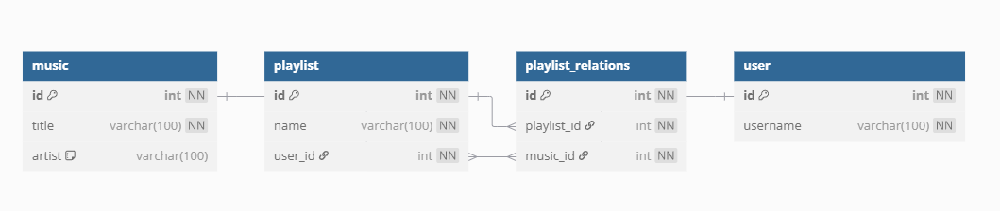

# Janji 
Saya Yusrilia Hidayanti dengan NIM 2306828 mengerjakan Tugas Praktikum 7 dalam mata kuliah Desain dan Pemrograman Berorientasi Objek untuk keberkahanNya maka saya tidak melakukan kecurangan seperti yang telah dispesifikasikan. Aamiin.

# Desain Progam

## 🎵 Tentang MelodyMuse
MelodyMuse adalah aplikasi web sederhana untuk membuat dan mengelola playlist musik menggunakan PHP + DataBase. Dibangun dengan pendekatan OOP, PDO (Prepared Statement), dan struktur modular. Aplikasi ini memiliki fitur berikut:
- Tambah, lihat, edit, dan hapus (CRUD) user.
- Tambah, lihat, edit, dan hapus (CRUD) musik.
- Tambah, lihat, edit, dan hapus (CRUD) playlist.
- Tambah, lihat, edit, dan hapus (CRUD) musik dalam playlist.
- Fitur pencarian musik berdasarkan judul/artis
- Struktur modular MVC-like (Model, Controller, View)
- Aman dari SQL Injection dengan PDO & Prepared Statement

## 🗂 Struktur Direktori
```
/Project/
│
├── class/                  → Kelas OOP untuk tiap entitas
│   ├── Music.php
│   ├── Playlist.php
│   ├── PlaylistRelation.php
│   └── User.php
│
├── config/                 → Konfigurasi Koneksi DB
│   └── db.php             
│
├── db/                     → DB
│   └── db_melody.sql      
│
├── view/                   → Halaman frontend
│   ├── footer.php
│   ├── header.php
│   ├── music.php
│   ├── playlist_details.php
│   ├── playlists.php
│   └── users.php
│
├── index.php               → Halaman utama 
├── style.css               → Style
└── README.md               → Dokumentasi 

```


## 🧩 ERD
Berikut adalah desain ERD database yang dipakai dalam MelodyMuse


Database terdiri dari 4 tabel:

- `user` — Menyimpan data pengguna
- `music` — Menyimpan daftar lagu
- `playlist` — Menyimpan daftar playlist yang dibuat user
- `playlist_relations` — Menghubungkan banyak lagu ke banyak playlist (many-to-many)

Semua tabel menggunakan AUTO_INCREMENT, PRIMARY KEY, dan relasi FOREIGN KEY.


# Penjelasan Alur
1. Inisialisasi & Koneksi Database
    - File `config/db.php` akan dijalankan pertama kali untuk membuka koneksi ke database menggunakan **PDO**.
    - Semua class model (Music.php, Playlist.php, dll) akan menggunakan koneksi ini.

2. Routing via `index.php`
    - File `index.php` memuat header, halaman utama (menu navigasi), dan footer.
    - Navigasi mengarahkan user ke halaman tertentu seperti:
        - `view/music.php`
        - `view/playlists.php`
        - `view/playlist_details.php`
        - `view/users.php`

3. CRUD Data (OOP Implementation)
    - Setiap entitas (User, Music, Playlist, PlaylistRelation) memiliki class masing-masing di folder class/
        - `Music.php`: tambah/lihat/edit/delete musik
        - `Playlist.php`: memuat playlist milik user dan membuat/edit/delete playlist
        - `PlaylistRelation.php`: untuk relasi lagu ke playlist
        - `User.php`: tambah/lihat/edit/delete user

    - Setiap aksi CRUD akan:
        - Menerima request dari form HTML
        - Memanggil method
        - Melakukan query ke DB melalui prepared statements

4. Menampilkan Data (Views)
    - Folder view/ berisi file-file tampilan:
        - `music.php`: Menampilkan daftar lagu + form tambah/edit
        - `users.php`: Menampilkan daftar user + form tambah/edit
        - `playlists.php`: Menampilkan daftar playlist dan user pembuat
        - `playlist_details.php`: Menampilkan lagu-lagu dalam playlist tertentu + fitur tambah lagu

    - Setiap tampilan:
        - Menyertakan `header.php` dan `footer.php`
        - Mengambil data dari class melalui pemanggilan di awal file

5. Relasi Data: Menambahkan Lagu ke Playlist
    - Di `playlist_details.php`, user bisa menambahkan lagu ke playlist melalui dropdown.
    - Data dikirim ke method `createRelation()` di `PlaylistRelation.php`.
    - Query akan memasukkan `playlist_id` dan `music_id` ke tabel `playlist_relations`.

6. Fitur Pencarian Musik
    - Di halaman `music.php`, terdapat form pencarian berdasarkan judul atau artis.
    - Input dari user dikirim via GET, dan query dijalankan menggunakan:
`WHERE title LIKE ? OR artist LIKE ?`
   - Hasil pencarian ditampilkan.

7. Penghapusan dan Update Data
    - Saat user menekan tombol "Edit", ID entitas dikirim via URL (GET).
    - Method `update()` di class terkait akan dijalankan.
    - Saat user menekan tombol "Delete", ID entitas dikirim via URL (GET).
    - Method `delete()` di class terkait akan dijalankan.


# Dokumentasi

https://github.com/user-attachments/assets/3eff34f7-7060-440f-ab5a-4a5abc5dbbe6
